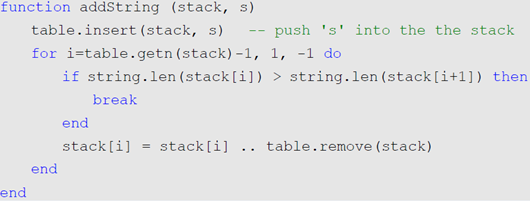

# lua学习笔记（二）

`write by maxx`

* [字符串缓冲](#luaStringBuffer)
* [func{...} == func({...})](#luaTableFunc)
* [metatable](#luametaTable)
	* [metamethod选择原则](#metatableChoose)
	* [table访问方法](#tablefangwen)

<h2 id="luaStringBuffer">**字符串缓冲**</h2>

简单地说，就是lua的字符串连接不像想象中的那么高效，当有大量字符串连接操作的时候，需要一些优化  
* 用栈保存，尽量少合并  


* 使用table.concat()连接字符串

<h2 id="luaTableFunc">**特别的函数调用方式**</h2>

* func{...} == func({...})

<h2 id="luametaTable">**Metatable**</h2>

通过`setmetatable(child, parent)`和`getmetatable(table)`设置和获取元table  
如果设置了`__metatable`（注意是元table的__metatable），则`setmetatable`（非元table）会出错

```
个人感觉元table，一般是parent的子table（为了保护）
```

* 可以继承一些方法
* 类似C++的重载运算符
```cpp
--需要重载的操作符  
--算数类型  
-- __add(a, b)                     for a + b  
-- __sub(a, b)                     for a - b  
-- __mul(a, b)                     for a * b  
-- __div(a, b)                     for a / b  
-- __mod(a, b)                     for a % b  
-- __pow(a, b)                     for a ^ b  
-- __unm(a)                        for -a  
-- __concat(a, b)                  for a .. b  
-- __len(a)                        for #a  
--关系类型  
-- __eq(a, b)                      for a == b  
-- __lt(a, b)                      for a < b  
-- __le(a, b)                      for a <= b  
--table访问的元方法  
-- __index(a, b)  <fn or a table>  for a.b  
-- __newindex(a,b)  
-- __newindex(a, b, c)             for a.b = c  
-- __call(a, ...)                  for a(...)  
-- 库定义的元方法  
-- __metatable                      保护元表,不可读写  
-- __tostring 
```
* 可以当做一个类来使用（这个还不是很懂，待补充）

<h3 id="metatableChoose">lua选择metamethod原则</h3>

* 如果第一个参数存在带有__add域的metatable，Lua使用它作为metamethod，和第二个参数无关；  
* 否则第二个参数存在带有__add域的metatable，Lua使用它作为metamethod 否则报错。

<h3 id="tablefangwen">table访问的元方法</h3>

* __index  
```
“当我们访问一个表的不存在的域，返回结果为nil，这是正确的，但并不一致正确。实际上，这种访问触发lua解释器去查找__index metamethod：如果不存在，返回结果为nil；如果存在则由__index metamethod 返回结果。”
```
	我们可以通过这个东西，实现有默认值得表（如果要创建，还需要__newindex）

* __newindex
```
“__newindex metamethod用来对表更新，__index则用来对表访问。当你给表的一个缺少的域赋值，解释器就会查找__newindex metamethod：如果存在则调用这个函数而不进行赋值操作。像__index一样，如果metamethod是一个表，解释器对指定的那个表，而不是原始的表进行赋值操作”
```
